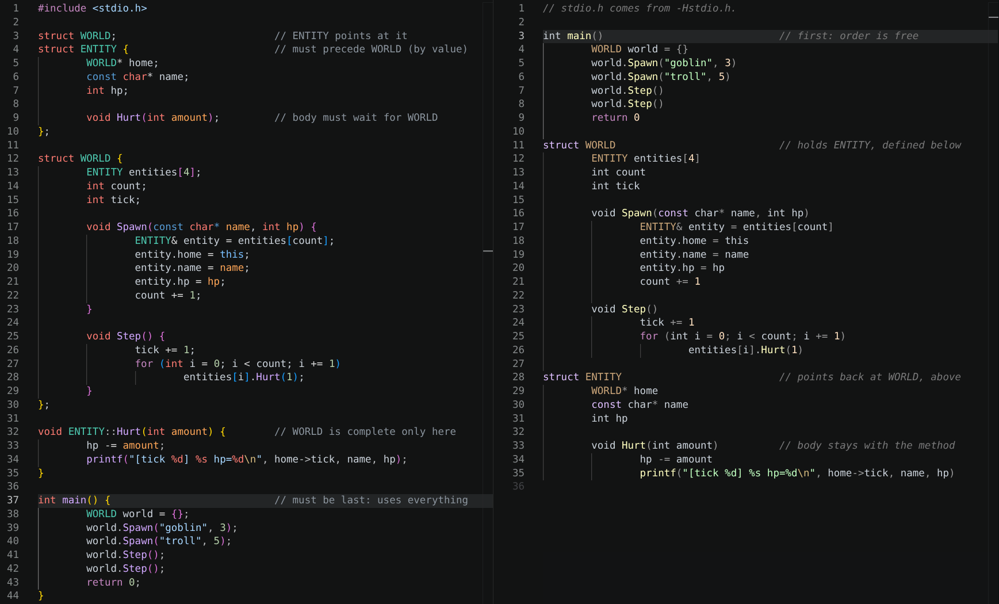

# cppy

Python-like C++ syntax to C++ transpiler.
No braces, semicolons, or any ordering relevance.

Experimental!



The same program twice. C++ on the left, CPPY on the right.

# Usage

```sh
./cppy program.cppy -o bundle.cpp -Hsomeheader.h/hpp
<C++ compiler> bundle.cpp -o program
```

To build the `cppy-unstable` binary from the current source, use `build.sh`.

# How It Works

- Indentation opens a scope
- Semicolons are auto-inserted
- Parentheses around a control clause are optional, `if x == y` is `if (x == y)`
- Ordering is bypassed by building a naive tree of the code and emitting in phases into a single `bundle.cpp`
- Multiple `.cppy` files are passed together and bundled as one; there is nothing to include and the order they are listed in does not matter
- Incomplete types are resolved to the extent permitted by C++
- Switches auto-break
- Indentation is spaces only
- Comments are ignored
- A line continues when a bracket is open, or when it ends with a comma, `&&`, `||`, `|` or a backslash
- libcppy is optional, `-Hlibcppy/types.hpp` carries the types it is written in

# How It Doesn't Work

- It's only compatible with a subset of C++, but the idiom here is C-style C++ anyway
- Large code bases may struggle since it bundles, transpiling to multiple files could be a worthwhile extension
- `#` lines are all emitted first, so a conditional can't wrap a declaration, put those in a `.hpp` and `-H` it

# Header Mode

Produce a header file instead of a binary.

```sh
./cppy program.cppy -o bundle.hpp --header
```

# Highlighting

VSCode:
1. Build the extension
```sh
cd highlighters/vscode && npx @vscode/vsce package
```
2. Go to the Extensions tab
3. Click on the three vertical dots `install from VSIX` and pick `highlighters/vscode/cppy-0.0.1.vsix` 